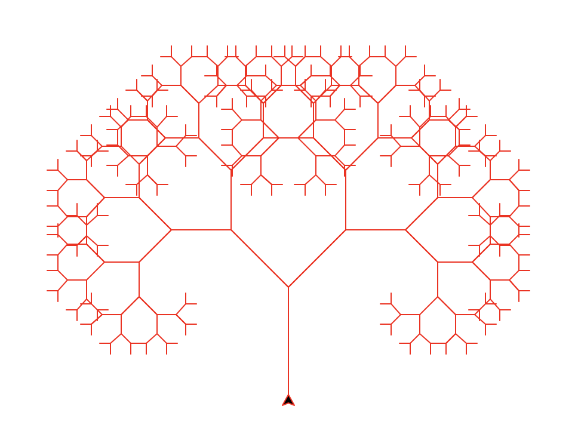
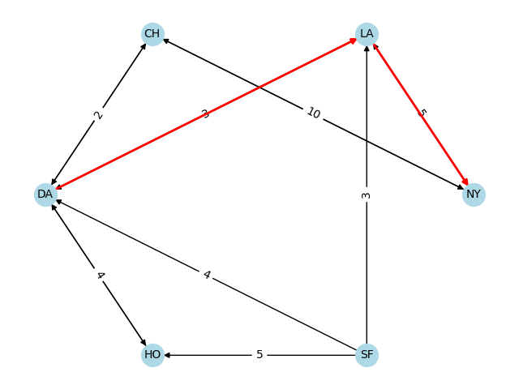
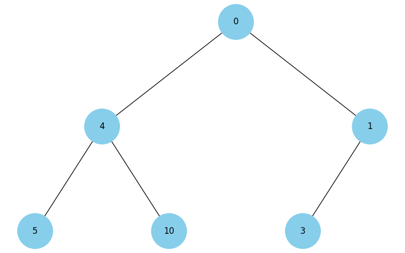
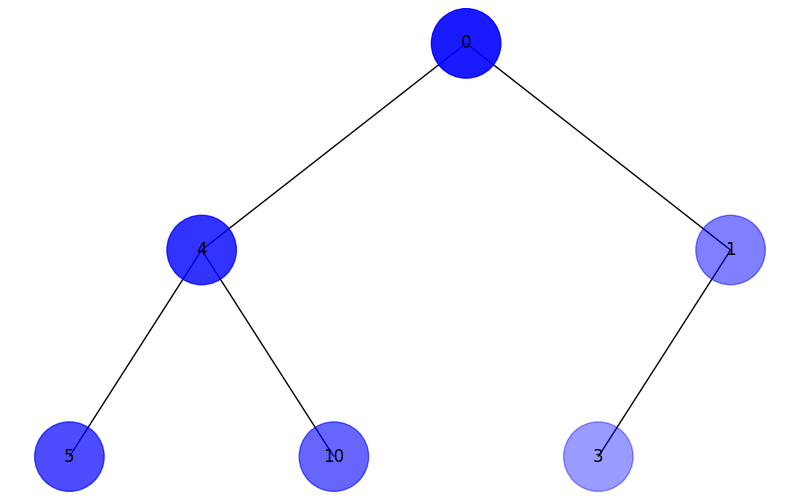
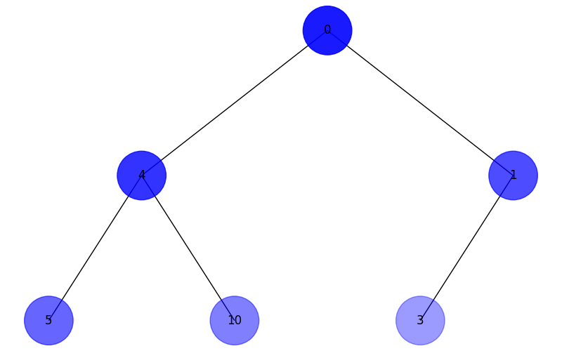

**task 1**

LinkedList's method `insertion_sort`
LinkedList's method `reverse`
function `merge_llists`

Use examples inside task_1.py

---

**task 2**

Piphagoras tree examples - recustion level 9

---

**task 3**

examples visualisation:

The shortest paths from DA to NY

---

**task 4**

Binary heap examples

---

**task 5**

DFS

BFS

---

**task 6**

examples budget 100
| Algorithm | Total Cost | Total Calories | Items |
| ------------------- | ---------- | -------------- | ---------------------------- |
| greedy | 80 | 870 | cola, potato, pepsi, hot-dog |
| dynamic programming | 100 | 970 | potato, cola, pepsi, pizza |

---

**task 7**

Distribution of the sum of points when rolling two dice
10 000 000 times
| Points | Probability | Fraction |
|--------|-------------|----------|
| 2 | 2.77 | 1/36 |
| 3 | 5.55 | 2/36 |
| 4 | 8.33 | 3/36 |
| 5 | 11.12 | 4/36 |
| 6 | 13.88 | 5/36 |
| 7 | 16.66 | 6/36 |
| 8 | 13.88 | 5/36 |
| 9 | 11.12 | 4/36 |
| 10 | 8.34 | 3/36 |
| 11 | 5.55 | 2/36 |
| 12 | 2.79 | 1/36 |
